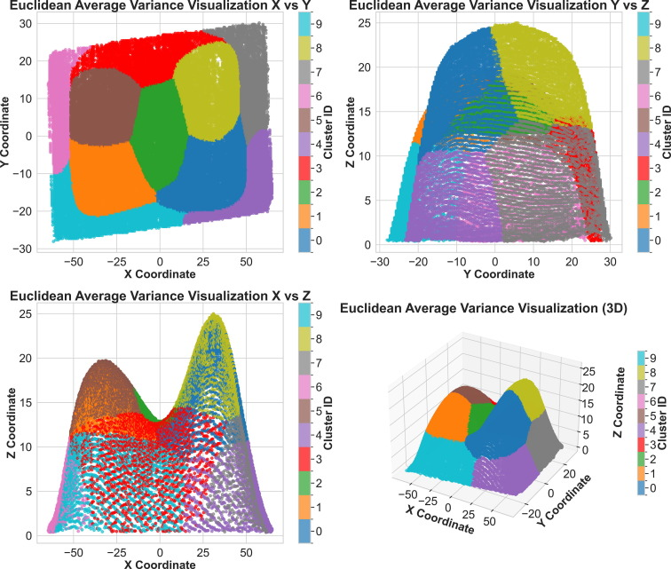

# Unveil the Relationship Between Process and Design Embedded in the 3D Point Cloud Using Unsupervised Learning
[](https://doi.org/10.1016/j.mfglet.2025.06.169)
[](LICENSE)


<p align="center">
  
  
</p>
<p align="center"><em>Euclidean Average Variance Visualizations for 3D point cloud scans. Left: Half Ball geometry. Right: Freeform geometry.</em></p>

This repository contains the code for the paper **"Unveil the relationship between process and design embedded in the 3D point cloud using unsupervised learning"** by Evans Nyanney and Zhaohui Geng.

It implements a robust, end-to-end unsupervised learning pipeline for 3D point cloud analysis. The project uses Local Principal Geodesic Analysis (PGA) and Spectral Clustering to detect and validate variations in structural geometry across manufactured parts.

The pipeline includes data ingestion, point cloud normalization, spectral clustering, calculation of Euclidean and Fréchet means, pointwise variance association, and comprehensive 3D data visualization.

## Table of Contents

- [Installation](#installation)
- [Data Availability](#data-availability)
- [Repository Structure](#repository-structure)
- [Methodological Summary](#methodological-summary)
- [Typical Workflow](#typical-workflow)
- [Metrics and Reporting](#metrics-and-reporting)
- [Citation](#citation)
- [License](#license)

## Installation

```bash
# Clone the repository
git clone https://github.com/yourusername/landmarks3D.git
cd landmarks3D

# Install dependencies
pip install -r requirements.txt
```

## Data Availability

This repository processes 3D point cloud coordinate scans and corresponding pointwise variance data.

To reproduce results locally, place your raw datasets (e.g., `Freeform Landmarks`, `Half Ball Landmarks`) and variance CSVs into the `data/` directory. Then follow the [Typical Workflow](#typical-workflow) to perform clustering and generate variance distribution models.

### Using a Different Dataset

The pipeline architecture is designed to handle generic 3D point cloud sets (`X`, `Y`, `Z` coordinates). To adapt it for a different dataset, ensure your input files are in CSV format and update the `pga_pipeline/data_loader.py` or modify the paths in `scripts/run_analysis.py`.

## Repository Structure

```
landmarks3D/                    # Root repository
├── pyproject.toml              # Package configuration
├── README.md
├── LICENSE
├── requirements.txt
│
├── pga_pipeline/               # Source code modules
│   ├── __init__.py
│   ├── _version.py             # Version string
│   ├── config.py               # Global constants and color palettes
│   ├── data_loader.py          # Data ingestion and parsing
│   ├── geometry.py             # Geometric operations, Fréchet means, and PGA
│   ├── clustering.py           # Spectral clustering and consistency validation
│   ├── stats.py                # Kruskal-Wallis testing and variance stats
│   └── visualization.py        # 3D plotting and density generation
│
├── scripts/                    # CLI entry points
│   ├── __init__.py
│   └── run_analysis.py         # Entry point for the full analysis pipeline
│
├── tests/                      # Test suite
│   ├── __init__.py
│   ├── test_clustering.py      # Tests for clustering algorithms
│   └── test_geometry.py        # Tests for geometric computations
│
├── data/                       # Datasets and pointwise variance data
│   ├── Freeform Landmarks/
│   ├── Half Ball Landmarks/
│   └── *.csv                   
│
├── DOCS/                       # Documentation and figures
│   └── images/
│
└── results/                    # Generated visual artifacts and CSVs
    ├── average_variance_plots/
    ├── cluster_visualizations/
    ├── means_visualizations/
    ├── pga_results/
    └── variance_distributions/
```

## Pipeline Architecture

The workflow is meticulously structured into the following core stages to provide an end-to-end framework for analyzing process-to-design variation in point clouds:


### 1. Data Acquisition & Registration
Raw `Freeform` and `Half-Ball` datasets are acquired and registered into a common coordinate system using Procrustes analysis to eliminate rigid body transformations.

### 2. Preprocessing & Normalization
The point clouds undergo scaling using Standard, MinMax, or Sphere normalization to prepare the geometries for manifold operations.

### 3. Spectral Clustering
An Affinity Matrix and Laplacian graph are constructed, followed by k-means clustering to segment the complex geometries.

### 4. Cluster Label Alignment
The Hungarian Algorithm is utilized to perfectly map and track identical cluster domains across varying part scans.

### 5. Geodesic Mean Computation
We compute the structural center of the geometries using both classical Euclidean Means and manifold-aware Fréchet Means.

### 6. Principal Geodesic Analysis (PGA)
Variations are mapped into Tangent Space to extract the principal geodesic directions governing the geometric deviation.

### 7. Clustering Consistency
Adjusted Rand Index (ARI) and Normalized Mutual Information (NMI) metrics guarantee the clustering algorithm is robust across multiple components.

### 8. Variance & Kruskal-Wallis
Statistical Kruskal-Wallis testing identifies whether structural variances show Significant Differences (p < 0.05) across clusters.

## Running the Pipeline

1. **Configure settings**: Adjust your hyperparameters in `pga_pipeline/config.py`.
2. **Execute**:
   ```bash
   python -m scripts.run_analysis
   ```
3. **Inspect**: Check the `results/` folder for 3D scatter plots, average variance mappings, geodesic vectors, and CSV reports.

## Citation

If this repository is useful in your research or work, please cite the paper:

**Paper:**
> E. Nyanney, Z. Geng, Unveil the relationship between process and design embedded in the 3D point cloud using unsupervised learning, *Manufacturing Letters* (2025). https://doi.org/10.1016/j.mfglet.2025.06.169

### BibTeX

~~~bibtex
@article{nyanney2025unveil,
  title={Unveil the relationship between process and design embedded in the 3D point cloud using unsupervised learning},
  author={Nyanney, Evans and Geng, Zhaohui},
  journal={Manufacturing Letters},
  volume={44},
  pages={1498--1506},
  year={2025},
  publisher={Elsevier}
}
~~~

## License

MIT License. See `LICENSE` for details.
