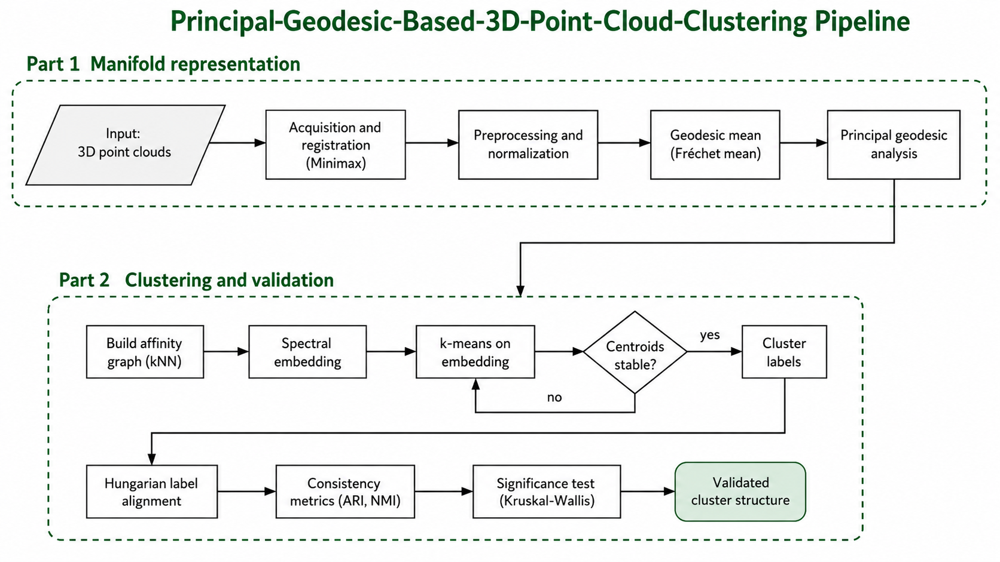
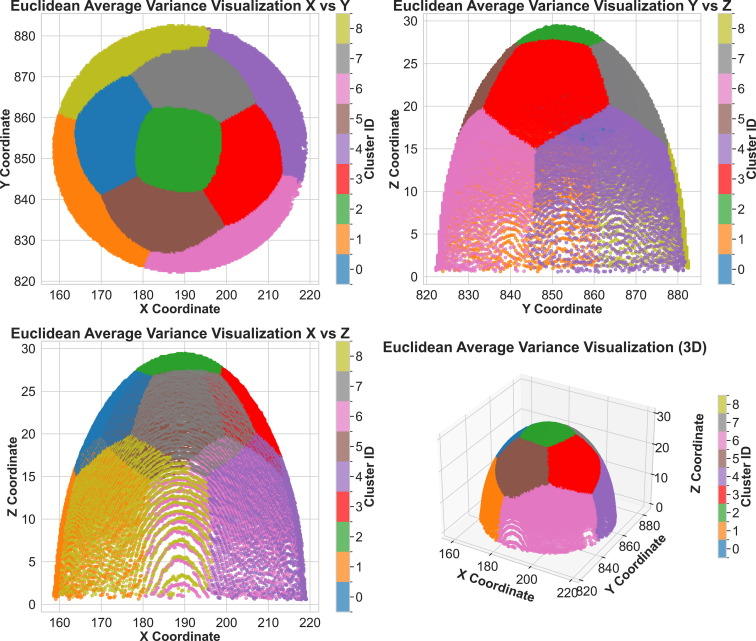

# Unveil the Relationship Between Process and Design Embedded in the 3D Point Cloud Using Unsupervised Learning
[](https://doi.org/10.1016/j.mfglet.2025.06.169)
[](https://doi.org/10.5281/zenodo.20690053)
[](LICENSE)


## Pipeline Architecture

<p align="center">
  
</p>

This repository contains the code for the paper **"Unveil the relationship between process and design embedded in the 3D point cloud using unsupervised learning"** by Evans Nyanney and Zhaohui Geng.

It implements a robust, end-to-end unsupervised learning pipeline for 3D point cloud analysis. The project uses Local Principal Geodesic Analysis (PGA) and Spectral Clustering to detect and validate variations in structural geometry across manufactured parts.

The pipeline includes data ingestion, point cloud normalization, spectral clustering, calculation of Euclidean and Fréchet means, pointwise variance association, and comprehensive 3D data visualization.

## Table of Contents

- [Installation](#installation)
- [Data Availability](#data-availability)
- [Repository Structure](#repository-structure)
- [Methodological Summary](#methodological-summary)
- [Typical Workflow](#typical-workflow)
- [Metrics and Reporting](#metrics-and-reporting)
- [Citation](#citation)
- [License](#license) 

## Installation 

```bash
# Clone the repository
git clone https://github.com/evansnyanney/Principal-Geodesic-Based-3D-Point-Cloud-Clustering-Analysis.git
cd Principal-Geodesic-Based-3D-Point-Cloud-Clustering-Analysis

# Install dependencies
pip install -r requirements.txt
```

## Data Availability

This repository processes 3D point cloud coordinate scans and corresponding pointwise variance data.

To reproduce results locally, place your raw datasets (e.g., `Freeform Landmarks`, `Half Ball Landmarks`) and variance CSVs into the `data/` directory. Then follow the [Typical Workflow](#typical-workflow) to perform clustering and generate variance distribution models.

### Using a Different Dataset

The pipeline architecture is designed to handle generic 3D point cloud sets (`X`, `Y`, `Z` coordinates). To adapt it for a different dataset, ensure your input files are in CSV format and update the `pga_pipeline/data_loader.py` or modify the paths in `scripts/run_analysis.py`.

## Repository Structure

```
landmarks3D/                    # Root repository
├── pyproject.toml              # Package configuration
├── README.md
├── LICENSE
├── requirements.txt
│
├── pga_pipeline/               # Source code modules
│   ├── __init__.py
│   ├── _version.py             # Version string
│   ├── config.py               # Global constants and color palettes
│   ├── data_loader.py          # Data ingestion and parsing
│   ├── geometry.py             # Geometric operations, Fréchet means, and PGA
│   ├── clustering.py           # Spectral clustering and consistency validation
│   ├── stats.py                # Kruskal-Wallis testing and variance stats
│   └── visualization.py        # 3D plotting and density generation
│
├── scripts/                    # CLI entry points
│   ├── __init__.py
│   └── run_analysis.py         # Entry point for the full analysis pipeline
│
├── tests/                      # Test suite
│   ├── __init__.py
│   ├── test_clustering.py      # Tests for clustering algorithms
│   └── test_geometry.py        # Tests for geometric computations
│
├── data/                       # Datasets and pointwise variance data
│   ├── Freeform Landmarks/
│   ├── Half Ball Landmarks/
│   └── *.csv                   
│
├── DOCS/                       # Documentation and figures
│
└── results/                    # Generated visual artifacts and CSVs
    ├── average_variance_plots/
    ├── cluster_visualizations/
    ├── means_visualizations/
    ├── pga_results/
    └── variance_distributions/
```

## Cluster Consistency

<p align="center">
  
  
</p>
<p align="center"><em>Euclidean Average Variance Visualizations for 3D point cloud scans. Left: Half Ball geometry. Right: Freeform geometry.</em></p>


## Running the Pipeline

1. **Configure settings**: Adjust your hyperparameters in `pga_pipeline/config.py`.
2. **Execute**:
   ```bash
   python -m scripts.run_analysis
   ```
3. **Inspect**: Check the `results/` folder for 3D scatter plots, average variance mappings, geodesic vectors, and CSV reports.

## Citation

If this repository is useful in your research or work, please cite the paper:

**Paper:**
> E. Nyanney, Z. Geng, Unveil the relationship between process and design embedded in the 3D point cloud using unsupervised learning, *Manufacturing Letters* (2025). https://doi.org/10.1016/j.mfglet.2025.06.169

### BibTeX

~~~bibtex
@article{nyanney2025unveil,
  title={Unveil the relationship between process and design embedded in the 3D point cloud using unsupervised learning},
  author={Nyanney, Evans and Geng, Zhaohui},
  journal={Manufacturing Letters},
  volume={44},
  pages={1498--1506},
  year={2025},
  publisher={Elsevier}
}
~~~

## License

MIT License. See `LICENSE` for details.
